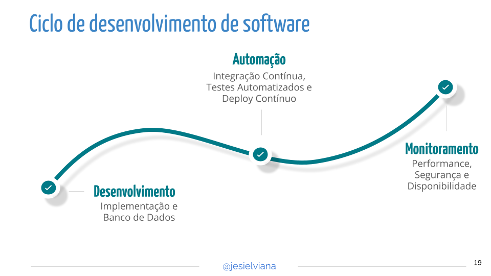
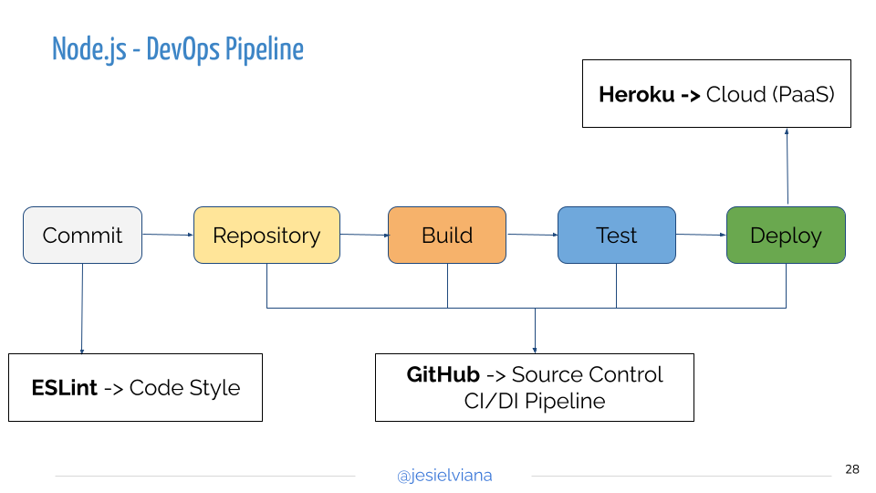

class: center, middle, block-text

# Práticas DevOps

Programação para Internet II - ADS

Prof. @jesielviana

---

# DevOps

DevOps é um conjunto de práticas que automatizam e integram os processos entre equipes de desenvolvimento de software e de TI para que possam criar, testar e lançar software com mais velocidade e confiabilidade
<small><a href="https://www.atlassian.com/br/devops" target="_blank">[2]</a></small>

"O DevOps não é o trabalho de uma pessoa individual. É o trabalho de todos."
<small>Christophe Capel - Gerente de produto do Jira</small>

---

# Integração Contínua

A **Integração Contínua - Continuous Integration (CI)** é uma prática de desenvolvimento de software em que os desenvolvedores, com frequência, juntam suas alterações de código em um repositório central e executam testes automatizados.
<small><a href="https://aws.amazon.com/pt/devops/continuous-integration/" target="_blank">[1]</a></small>

Os principais objetivos da integração contínua são encontrar e investigar **bugs** mais rapidamente, melhorar a **qualidade do software** e reduzir o tempo que leva para validar e **lançar novas atualizações de software**.
<small><a href="https://aws.amazon.com/pt/devops/continuous-integration/" target="_blank">[1]</a></small>

---

# Entrega Contínua & Implantação Contínua

A **Entrega Contínua - Continuous Delivery (CD)** é uma extensão da integração contínua, uma vez que implanta automaticamente todas as alterações de código em um ambiente de teste e / ou produção após o estágio de construção.
<small><a href="https://www.atlassian.com/br/continuous-delivery/principles/continuous-integration-vs-delivery-vs-deployment" target="_blank">[3]</a></small>

A **Implantação Contínua - Continuous Deployment (CD)** vai um passo além da entrega contínua. Com essa prática, toda mudança que passa por todos os estágios do pipeline de produção é liberada para seus clientes. Não há intervenção humana, e apenas um teste com falha impedirá que uma nova mudança seja implantada na produção.
<small><a href="https://www.atlassian.com/br/continuous-delivery/principles/continuous-integration-vs-delivery-vs-deployment" target="_blank">[3]</a></small>

---

class: center, middle, block-text

# Versionamento Semântico

[https://semver.org/lang/pt-BR/](https://semver.org/lang/pt-BR/)

---

class: center, middle, block-text

# Fluxo de integração contínua

<small><a href="https://aws.amazon.com/pt/devops/continuous-integration/" target="_blank">Fonte</a></small>

---

class: center, middle, block-text

---

class: center, middle, block-text

---

# Ferramentas

- **[Github Actions](https://docs.github.com/pt/actions)**
- [Gitlab CI/CD](https://about.gitlab.com/stages-devops-lifecycle/continuous-integration/)
- [Jenkins](https://www.jenkins.io/)
- [Travis-ci](https://www.travis-ci.com/)

---

# Por que AUTOMATIZAR?

- Rotinas manuais são mais passíveis de ERROS;
- Geralmente nós ficamos enjoados em fazer tarefas repetitivas;
- Produtividade, foque no que é nas tarefas que o computador não pode fazer por você.
- etc...

---

# Vantagens do DevOps

- Velocidade;
- Entrega rápida;
- Confiabilidade;
- Escala;
- Colaboração melhorada;
- Segurança.

---

class: center, middle, block-text

# Hands-on

---

class: center, middle, block-text

# Práticas DevOps

Programação para Internet II - ADS

Prof. @jesielviana
