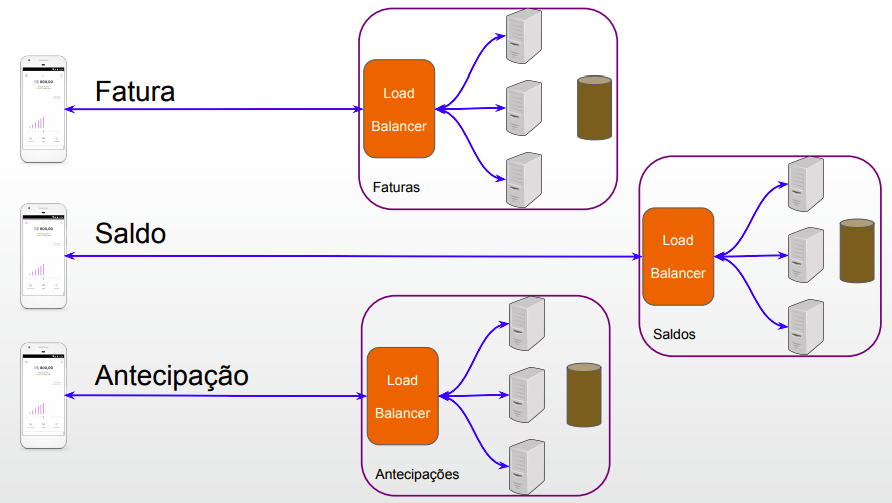

class: center, middle, block-text

# Arquitetura de Aplicações Web

Programação para Internet II - ADS

Prof. @jesielviana

---

# Arquitetura de aplicações Web

A arquitetura de aplicações da Web descreve a estrutura e interações entre seus componentes, bancos de dados e sistemas externos.

---

# Tipos de aplicações

- Aplicações estáticas (HTML, CSS e Javascript)
- Aplicações dinâmicas/interativas

---

# Aplicações estáticas

Utiliza a famosa arquitetua cliente-servidor simples e pura.

<a href="https://developer.mozilla.org/en-US/docs/Learn/Server-side/First_steps/Client-Server_overview" target="_blank">Fonte</a>

---

# Aplicações dinâmicas/interativas

Geralmente baseada na arquitetura cliente-servidor, porém com mais outras camadas.

<a href="https://developer.mozilla.org/en-US/docs/Learn/Server-side/First_steps/Client-Server_overview" target="_blank">Fonte</a>

---

# Arquitetura Monolítica

<a href="https://www.opus-software.com.br/micro-servicos-arquietura-monolitica" target="_blank">Fonte</a>

- Server-rendered HTML
- Nova alternativa: [https://hotwire.dev/](https://hotwire.dev/)

---

# Arquitetura REST

Estilo de arquitetura de software. Conforme descrito em uma dissertação de Roy Fielding, o REST é um conjunto de princípios que definem como Web Standards, tais como HTTP e URIs, devem ser usados para comunicação na Web.

<a href="https://medium.com/javarevisited/top-5-books-and-courses-to-learn-restful-web-services-in-java-using-spring-mvc-and-spring-boot-79ec4b351d12" target="_blank">Fonte</a>

---

# REST com Single-Page Applications (SPAs)

Aplicações SPA em vez de carregar páginas completamente novas do servidor a cada ação do usuário, elas carregam só o conteúdo dinâmico, geralemente JSON, sem a necessidade de recarregar arquivos estáticos (HTML, CSS e JS).

<a href="https://bezkoder.com/vue-js-node-js-express-mysql-crud-example/" target="_blank">Fonte</a>

---

# Arquitetura de Microsserviços

Microsserviço é uma abordagem para desenvolver uma única aplicação como uma suíte de serviços, cada um rodando em seu próprio processo e se comunicando através de mecanismos leves, geralmente através de uma API HTTP. Estes serviços são construídos através de pequenas responsabilidades e publicados em produção de maneira independente através de processos de deploys automatizados <a href="https://martinfowler.com/articles/microservices.html" target="_blank">[1]</a>.

---

class: center, middle

# Exemplo de Microsserviços no Nubank

<a class="reference" href="https://www.infoq.com/br/presentations/construindo-a-nuconta-do-zero-a-milhoes-de-clientes/" target="_blank">Fonte</a>

---

class: center, middle

# API Gateway

<a class="reference" href="https://www.nginx.com/blog/building-microservices-using-an-api-gateway/" target="_blank">Fonte</a>

---

class: center, middle, block-text

# Arquitetura de Aplicações Web

Programação para Internet II - ADS

Prof. @jesielviana
