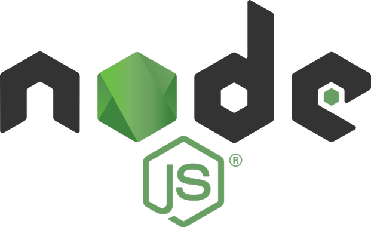

class: center, middle, block-text

# Introdução ao



Programação para Internet II - ADS 2020.2

Prof. @jesielviana

---

# Node.js

<q cite="https://leanpub.com/construindo-apis-testaveis-com-nodejs"> Node.js não é uma linguagem de programação, tampouco um framework. A definição mais apropriada seria: um ambiente de runtime para Javascript que roda em cima de uma engine conhecida como Google v8. </q> <a href="https://leanpub.com/construindo-apis-testaveis-com-nodejs" target="_blank">Waldemar Neto</a>

<q cite="https://nodejs.org"> <a href="https://nodejs.org" target="_blank">Node.js®</a> is a JavaScript runtime built on Chrome's V8 JavaScript engine. </q>

---

# V8

<q cite="https://v8.dev"> <a href="https://v8.dev" target="_blank">V8</a> is Google’s open source high-performance JavaScript engine, written in C++. It is used in Chrome and in Node.js, among others. </q>

---

class: center

# Client-side JavaScript x Node.js


<div  class="reference">
Fonte: <a href="https://twitter.com/kosamari/status/837650274672082944" target="_blank">@kosamari</a>
</div>

---

# Node.js

- Single-thread
- Event-driven
- Non-blocking I/O

---

# Arquitetura Node.js


<div  class="reference">
Fonte: <a href="https://scoutapm.com/blog/nodejs-architecture-and-12-best-practices-for-nodejs-development" target="_blank">Scout APM</a>
</div>

---

# Leitura de arquivo de forma assíncrona (não-bloqueante)

```javascript{numberLines: true}
const fs = require('fs')

console.log('vamos ler um arquivo de forma assíncrona')

// o arquivo 'arquivo.txt' deve estar no mesmo diretório que este código
fs.readFile('./arquivo.txt', 'utf8', (erro, conteudo) => {
  if (erro) throw erro
  console.log('arquivo lido, quantidade de caracteres: ', conteudo.length)
})

console.log('primeiro exemplo Node.js assíncrono')
```

<a target="_blank" href="https://github.com/ifpipicos/resources/blob/main/arquivo.txt">
arquivo.txt
</a>

---

# Leitura de arquivo de forma síncrona (bloqueante)

```javascript{numberLines: true}
const fs = require('fs')

console.log('vamos ler um arquivo de forma síncrona')

// o arquivo 'arquivo.txt' deve estar no mesmo diretório que este código
try {
  const conteudo = fs.readFileSync('arquivo.txt', 'utf-8')
  console.log('arquivo lido, quantidade de caracteres: ', conteudo.length)
} catch (err) {
  console.log(err)
}

console.log('primeiro exemplo Node.js síncrono')
```

<a target="_blank" href="https://github.com/ifpipicos/resources/blob/main/arquivo.txt">
arquivo.txt
</a>

---

# Criando Servidor HTTP

```javascript{numberLines: true}
const http = require('http')

const PORT = 3000
const SUCCESS_CODE = 200

const server = http.createServer((req, res) => {
  res.statusCode = SUCCESS_CODE
  res.setHeader('Content-Type', 'text/html')
  res.end('<h1>Hello World!</h1>')
})

server.listen(PORT, () => {
  console.log('Servidor rodando na porta: ', PORT)
})
```

---

class: center, middle, block-text

# Hands-on

---

class: center, middle, block-text

# Introdução ao


Programação para Internet II - ADS 2020.2

Prof. @jesielviana
