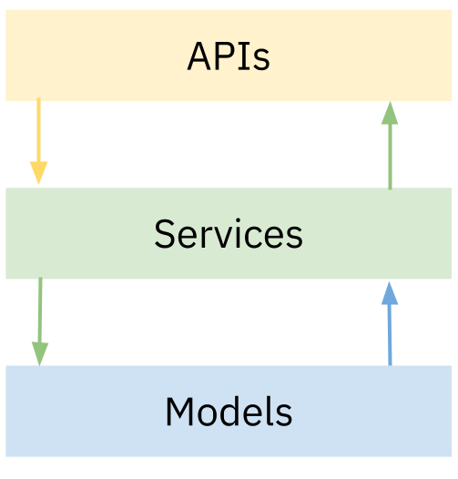

class: center, middle, block-text

# Boas práticas de arquitetura Node.js

Programação para Internet II - ADS 2020.2

Prof. @jesielviana

---

"Arquitetura de Software é um conjunto de
decisões de design que, se tomadas
incorretamente, pode causar o
cancelamento de um projeto",
<a href="https://twitter.com/eoinwoodz" targe="_blank">Eoin Woods</a>.

## Principais objetivos de uma boa arquitetura Node.js

- Escrever um código limpo e legível
- Favorecer a reusabilidade de código/módulos
- Evitar repetição
- Adicionar novas funcionalidades sem interromper o código existente

---

# Estrutura de diretórios

Diretório root/raiz do projeto

```shell
config/
src/
tests/
.gitignore
server.js
package.json
```

Um padrão comum em diversas linguagens é colocar o código da aplicação em um diretório source normalmente chamado src.
Dessa maneira evita-se misturar o código de produção com códigos de testes e arquivos de configuração.

---

# Estrtura do código da aplicação

<div class="two">
<section>
<p>Separação por funcionalidade</p>

```shell{numberLines: false}
src/
    products/
      products.controller.js
      products.model.js
      products.routes.js
    users/
      users.controller.js
      users.model.js
      users.routes.js
    app.js

```

</section>

<section>
<p>Separação por responsabilidade</p>

```bash{numberLines: false}
src/
    controller/
      products.js
      users.
    model/
      product.js
      user.js
    routes/
      index.js
      products.js
      users.js
    app.js
```

</section>
</div>

---

# Arquitetura em camadas



---

# Separe as regras de negócios das rotas de API

```js{numberLines: true}
router.get('/', async (req, res) => {
  try {
    const users = await usersController.get()
    res.send(users)
  } catch (err) {
    res.status(400).send(err)
  }
})

router.get('/:id', async (req, res) => {
  const {
    params: { id }
  } = req
  try {
    const user = await usersController.getById(id)
    res.send(user)
  } catch (err) {
    res.status(400).send(err)
  }
})

router.post('/', async (req, res) => {
  const { name, email, password } = req.body
  const userDTO = { name, email, password }
  try {
    await usersController.create(userDTO)
    res.status(201).send('Success!')
  } catch (err) {
    res.status(400).send(err)
  }
})
```

<div  class="reference">
routes/users.js
</div>

---

# Separe as regras de negócios das rotas de API

```js{numberLines: true}
async get() {
  try {
    return await this.User.find({}, '_id name email');
  } catch (err) {
    throw new Error(err);
  }
}

async getById(id) {
  try {
    return await this.User.findById(id, '_id name email');
  } catch (err) {
    throw new Error(err);
  }
}

async create(userDTO) {
  try {
    const user = new this.User(userDTO);
    await user.save();
  } catch (err) {
    throw new Error(err);
  }
}
```

<div  class="reference">
controllers/users.js
</div>

---

# Use async await

```js{numberLines: true}

//bad (promise then)
create(userDTO) {
  const user = new this.User(req.body)
  return user.save()
    .then(() => {
      console.log('Success!')
      })
    .catch((err) => {
      return err
    });
}

// good (async await)
async create(userDTO) {
  try {
    const user = new this.User(userDTO)
    await user.save()
  } catch (err) {
    throw new Error(err)
  }
}

```

---

# Prefira arrow functions ao invés de Function expression

```js{numberLines: true}
// bad
router.get('/', function (req, res) {
  res.json(cursos)
})

// good
router.get('/', (req, res) => res.json(cursos))
```

---

# Boa práticas

- Arquivos de configurações em um diretório (config)
- Use injeção de dependência (flexibilidade, evite acoplamento)
- Escreva testes unitários para seus controllers/services
- Use um Style Guide (StandardJS)
- Use um Linter e Formatter (StandardJS)
- Use gzip compression
- Use gerenciadores de processos (pm2, forever)

---

class: center, middle, block-text

# Implemente no seu projeto as boa práticas que achar pertinentes

---

# Referências

- [https://blog.logrocket.com/the-perfect-architecture-flow-for-your-next-node-js-project/](https://blog.logrocket.com/the-perfect-architecture-flow-for-your-next-node-js-project/)
- [https://dev.to/santypk4/bulletproof-node-js-project-architecture-4epf](https://dev.to/santypk4/bulletproof-node-js-project-architecture-4epf)
- [https://expressjs.com/pt-br/advanced/pm.html](https://expressjs.com/pt-br/advanced/pm.html)
- [https://developer.mozilla.org/en-US/docs/Web/JavaScript/Reference/Functions/Arrow_functions](https://developer.mozilla.org/en-US/docs/Web/JavaScript/Reference/Functions/Arrow_functions)
- [https://imasters.com.br/front-end/entenda-tudo-sobre-asyncawait](https://imasters.com.br/front-end/entenda-tudo-sobre-asyncawait)

---

class: center, middle, block-text

# Boas práticas de arquitetura Node.js

Programação para Internet II - ADS 2020.2

Prof. @jesielviana
